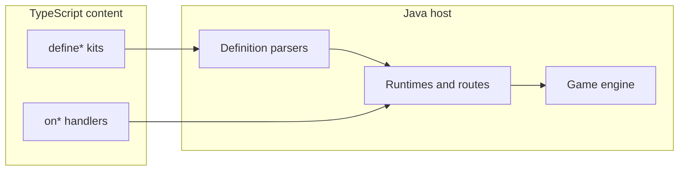

# TypeScript Bridge Improvements Roadmap

## Goal

Make `content/` the place you author OSRS-style content (skills, combat, items behavior, UI hooks, social) without writing Java. Java stays the engine/host; every gameplay system you port should have a TS registration or handler surface.

Scripts are bound to **loaded cache IDs**. ID ceilings are now raised to 65535 (`ScriptEntityLimits`, `content/src/core/limits.ts`, `ItemConstants.ITEM_LIMIT = 65536`). Porting “as much OSRS as possible” still requires growing the bridge **and** shipping an OSRS cache pack for visuals.

Existing pattern to copy everywhere: schema-v1 `defineX` → Java parser → Java-owned runtime → host routes (see [ScriptResourceRuntime.java](engine/server/src/main/java/com/rs2/script/resource/ScriptResourceRuntime.java) + [gathering.ts](content/src/sdk/gathering.ts)). Prefer that over one-off `onObject` spaghetti for repeated OSRS loops.

---

## Current status

| Phase | Status | Notes |
| --- | --- | --- |
| **0** — Entity capacity and author truth | **Done** | 65535 ceilings, `player.ts` / `bot.ts` quarantined, docs exist |
| **0.5** — Bridge hardening | **Next** | See [TYPESCRIPT_BRIDGE_REVIEW.md](../../TYPESCRIPT_BRIDGE_REVIEW.md) Priority 1 |
| **1** — Player capability parity | **~90%** | equip/unequip, openBank, prayer, magic routes done; attack styles / venom TBD |
| **2** — Skilling kits | **Next feature work** | woodcutting exists; mining/fishing + processing port pending |
| **3–8** | Pending | See phases below |

---

## Gap reference

Phases reference these gaps. Keep this table in sync when adding new phases.

| Gap | Description |
| --- | --- |
| **1** | Custom item/NPC/object definitions beyond raw cache (overlays + pack) |
| **2** | Client UI authoring and interface lifecycle |
| **3** | Skilling kit coverage (gathering, processing, thieving, FM, agility) |
| **4** | World NPC combat AI (non-boss mobs) |
| **5** | Player write APIs and economy/social (bank, trade, GE) |
| **6** | Author API confusion (dual `Player` / `ScriptedPlayer` contracts) |
| **7** | Minigame instance lifecycle |
| **8** | Content iteration workflow (watch, reload diagnostics) |

---

## Route precedence

Incremental OSRS porting depends on a single, documented rule:

1. **Exact scripted route match** (object/NPC/item id + action + route kind) → script handler runs; legacy Java for that route is suppressed via [ScriptInteractionGate.java](engine/server/src/main/java/com/rs2/script/ScriptInteractionGate.java).
2. **No scripted registration** for that route → legacy Java behavior runs unchanged.
3. **Same cache id, different tile** → only the globally registered route fires; unregistered tiles keep legacy behavior (see [woodcutting.ts](content/src/resources/woodcutting.ts) comment on Dragon Island).

Kits must register host routes for every id they own so scripted content wins on port.

---

## Kit boundaries

| Kit | Use when | Do not use when |
| --- | --- | --- |
| **`defineBoss`** | Instanced/arena encounters, multi-phase, arena reservation, `ScriptEncounterService` ownership | World-spawned NPCs that share the open world |
| **`defineMob`** | World-spawned NPCs replacing `NpcCombat` switch cases; stat-driven AI with optional tick hooks | Multi-phase bosses, arena encounters, roster-wide rewards |
| **`defineGatheringResource`** | Tool + deplete/respawn + XP loops (woodcutting, mining, fishing) | Item-on-item processing (cooking, smithing) |
| **`defineProcessingSkill`** | Extract **after** 1–2 real ports prove the shape; cook/smith/fletch/herblore loops | First port of a skill — use raw `onItemOnObject` / `onItemOnItem` first |
| **`defineRaid`** | Multi-room PvM with lobby, muster, roster-wide reward barrier | Single-room wave minigames (use `defineMinigame`) |

---

## Phase 0 — Entity capacity and author truth ✅ Done

Unblocks real OSRS IDs and stops dual-API confusion.

1. ✅ **Raise ID ceilings** to 65535 — `ScriptEntityLimits`, bridge validators, `ItemConstants.ITEM_LIMIT`.
2. ✅ **Single player API for handlers** — `ScriptedPlayer` in [runtime.ts](content/src/core/runtime.ts) is canonical; [player.ts](content/src/core/player.ts) / [bot.ts](content/src/core/bot.ts) marked design-only.
3. ✅ **Contract docs** — [docs/SCRIPT_BRIDGE.md](../../docs/SCRIPT_BRIDGE.md) and auto-synced [docs/API_INVENTORY.md](../../docs/API_INVENTORY.md) exist; keep them updated per phase.

**Acceptance (regression checklist):**
- [x] TS builders and Java parsers reject ids > 65535.
- [x] `pnpm --filter @singlescape/content test` passes (API inventory in sync).
- [x] No handler examples import `Player` from `player.ts`.

---

## Phase 0.5 — Bridge hardening (prerequisite for new write APIs)

Address Priority 1 findings in [TYPESCRIPT_BRIDGE_REVIEW.md](../../TYPESCRIPT_BRIDGE_REVIEW.md) before adding more mutation surface (mob AI, overlays, trade hooks).

1. **Input validation layer** — shared `BridgeValidation` (or equivalent) for all new Java exports; null-safe strings, integral ids, coordinate bounds.
2. **`ScriptHost` locking** — `ReadWriteLock` for registry reads vs writes; consistent snapshot for `getRuntimeStatus()`.
3. **Mutation guards** — `canMutate()` on `grantReward()` and any new write facades.
4. **Guest exception handling** — catch `PolyglotException` in `ScriptExecutor` for source location in reload errors.

**Acceptance:**
- [ ] Priority 1 review items have tests or are explicitly deferred with issue links.
- [ ] New facades added in Phases 1+ use the validation utility.
- [ ] `getRuntimeStatus()` returns generation + registry from one synchronized snapshot.

---

## Phase 1 — Player capability parity (~90% done)

Make a script able to do what Java content already does to a player.

| API | Status | Where |
| --- | --- | --- |
| `equip` / `unequip` / slot bonuses | ✅ Done | [ScriptedEquipment.java](engine/server/src/main/java/com/rs2/script/capability/ScriptedEquipment.java), [equipment.ts](content/src/sdk/equipment.ts) |
| `openBank()` | ✅ Done | [ScriptedPlayer.java](engine/server/src/main/java/com/rs2/script/ScriptedPlayer.java) |
| Prayer view | ✅ Done | [ScriptedPrayer.java](engine/server/src/main/java/com/rs2/script/capability/ScriptedPrayer.java), [prayer.ts](content/src/sdk/prayer.ts) |
| Magic on NPC/player + rune helpers | ✅ Done | [ScriptBindings.java](engine/server/src/main/java/com/rs2/script/ScriptBindings.java), [magic.ts](content/src/sdk/magic.ts) |
| Combat facade expansion | Partial | `underAttack()`, `poisoned()` done; attack styles, venom TBD |

**Remaining:**
- Attack style read/set if OSRS combat ports need it.
- Venom support on `ScriptedCombat` if ports require it.
- Sync [SCRIPT_BRIDGE.md](../../docs/SCRIPT_BRIDGE.md) inline types for new facades.

**Acceptance:**
- [x] Equipment write round-trips through `ItemAssistant` with facade guards.
- [x] `onMagicOnNpc` / `onMagicOnPlayer` register and dispatch.
- [ ] Combat style / venom APIs documented and tested if added.

---

## Phase 2 — Skilling kits (close gap 3) — **next feature work**

Extend the gathering runtime pattern instead of hand-rolling every skill.

1. **Generalize gathering** — mining/fishing/power-chop variants reuse [ScriptResourceRuntime.java](engine/server/src/main/java/com/rs2/script/resource/ScriptResourceRuntime.java). Add TS packs under `content/src/resources/` (mining, fishing) mirroring [woodcutting.ts](content/src/resources/woodcutting.ts).
2. **One processing port first** — implement cooking (e.g. shrimp on range) via `onItemOnObject` before extracting `defineProcessingSkill`.
3. **`defineProcessingSkill`** — extract from the cooking port: item-on-object / item-on-item + tick delay + level + success chance + product.
4. **`defineThievingTarget`**, **`defineFiremakingSpot`**, **`defineAgilityCourse`** — thin declarative kits once 2–3 real OSRS ports prove each shape.
5. Kits register host routes per [route precedence](#route-precedence) so they win over legacy Java for ported ids.

**Acceptance:**
- [ ] Mining and fishing resource modules with at least one resource each.
- [ ] Packet/dispatch test: scripted gathering route consumes legacy for registered object id.
- [ ] One cooking loop works via handlers; `defineProcessingSkill` only lands after that port.
- [ ] Reload test: resources survive `::scripts` without duplicate-route errors.

---

## Phase 3 — World mob AI (close gap 4)

Bosses work via `defineBoss`. Add the missing world-NPC authoring path:

- **`defineMob({ npcId, aggression, combatStyle, attackSpeed, maxHit, onSpawn, onTick, onDeath, ... })`**
- Java `ScriptMobRuntime` installs behavior for that cache NPC id (suppress legacy `NpcCombat` for registered ids only).
- Reuse encounter NPC handle primitives (walk/face/damage/animate) already on the bridge.
- **Not** a full custom NPC graphic API — still cache-bound `npcId` until Phase 4 pack ships.
- **Not** for arena bosses — use `defineBoss` (see [kit boundaries](#kit-boundaries)).

**Acceptance:**
- [ ] Registered mob id suppresses `NpcCombat` switch; unregistered ids unchanged.
- [ ] `onTick` / `onDeath` callbacks invalidated on reload and NPC despawn.
- [ ] At least one world mob ported entirely in TS (e.g. a low-tier guard or goblin).

---

## Phase 4 — Definition overlays (close gap 1, OSRS port critical)

You cannot invent new client graphics without cache work, but you **can** author server behavior and light metadata from TS:

1. **`defineItemOverlay` / `defineNpcOverlay` / `defineObjectOverlay`**: name, examine, stackability, equip slot/reqs/bonuses, NPC combat stats, object actions — merged at load over cache defs when present; reject unknown ids until cache pack includes them.
2. **Cache pack pipeline** — use the existing [asset-pipeline](../asset-pipeline/plan.md) (phases 3–8: OSRS import, model backport, custom ID namespace). Asset pipeline produces IDs/assets; bridge overlays attach server behavior to those IDs.
3. Load order: **cache definition → overlay merge → reject if id missing from cache**.
4. Keep `onItem` / `onNpc` / `onObject` for one-off interactions; overlays + kits for data-heavy OSRS tables.

**Acceptance:**
- [ ] Overlay merge is deterministic and logged at `::scripts` load.
- [ ] Unknown id in overlay fails content load with a clear error.
- [ ] One OSRS item/NPC/object ported with overlay + asset-pipeline id (not remapped to 2006 id).

---

## Phase 5 — Client UI realism (close gap 2)

Full “design new interfaces in TS” needs client changes. Practical bridge path:

1. Richer helpers on presentation: open interface by id, `setText` / `setItemModel` (exists), hide/show children, set scrollbar, send config/varp-like state if the protocol supports it.
2. **`defineInterfaceHook` pack**: group `onButton` handlers + open/close lifecycle for one interface id (quest journals, skill guides, custom shops).
3. **Later client track:** custom interface definitions compiled into cache — only after Phase 4 pack pipeline exists. Do not block content ports on this; reuse OSRS interface ids from the cache you ship.

**Acceptance:**
- [ ] `defineInterfaceHook` registers all button routes for one interface id atomically.
- [ ] One quest journal or skill guide ported using OSRS interface id from shipped cache.

---

## Phase 6 — Economy and social (close gap 5 remainder)

Needed for authentic OSRS ports, not for early skilling/PvM.

**MVP scope (ship this first):**
1. **Trade gate** — `onTradeRequest` with allow/deny; Java trade UI stays host-owned; no scripted offer mutation in MVP.
2. **PvP/wilderness queries** — skull state, safe-area check via `getCombat()`; `onPlayerDeath` already exists.
3. **PM observe** — `onPrivateMessage` event only (no send API in MVP).

**Later:**
- Trade offer mutate / accept hooks if Java trade cannot express a port.
- Friends / ignore lists.
- Grand Exchange (`defineGeOffer` / open GE) — after shop/bank parity; requires Java protocol matching.

**Acceptance:**
- [ ] Script can block trade initiation with a user-facing message.
- [ ] Wilderness skull / safe-area query available on combat facade.
- [ ] GE explicitly out of MVP; tracked as separate work item.

---

## Phase 7 — Minigames, randoms, bots (close gaps 7+)

1. **`defineMinigame`**: instance lifecycle, join/leave, score, NPC waves — compose `defineArea` / `defineRaid` where possible; generalize Fight Caves / Pest Control style ports.
2. Random event / login interruption hooks if OSRS parity is required.
3. **Bots:** wire [bot.ts](content/src/core/bot.ts) to a simulated-player host **or** keep quarantined (already marked design-only). Treat as parallel product, not content-authoring.

**Acceptance:**
- [ ] One wave-based minigame (e.g. Pest Control lobby + waves) ported with `defineMinigame`.
- [ ] Bot module status documented: wired or explicitly deferred.

---

## Phase 8 — Workflow polish (close gap 8)

Keep iteration cheap while porting:

- Documented one-command loop: `pnpm build:content` → `::scripts` (see [SCRIPTING.md](engine/server/SCRIPTING.md)).
- ✅ Watch mode in root [package.json](../../package.json) (`pnpm watch`).
- Fail-fast reload diagnostics for duplicate routes (extend route registry reporting).
- `::scripts status` shows quarantine warnings from reload (see review item 2.3.3).

**Acceptance:**
- [ ] CONTRIBUTING or SCRIPTING.md documents the full edit-reload loop.
- [ ] Duplicate route registration fails load with route key in error message.
- [ ] Quarantine state visible in `::scripts status` output.

---

## Suggested build order (next PRs)

| Order | Deliverable | Closes | Status |
| --- | --- | --- | --- |
| — | ID ceiling + ScriptedPlayer-only contract | Gap 6 | ✅ Done |
| — | Equipment + openBank + prayer + magic | Gap 5 (player) | ✅ Done |
| **1** | Bridge hardening (Phase 0.5) | Stability | Next |
| **2** | Mining/fishing gathering packs | Gap 3 | Pending |
| **3** | One cooking port → `defineProcessingSkill` | Gap 3 | Pending |
| **4** | `defineMob` world AI | Gap 4 | Pending |
| **5** | Overlays + asset-pipeline handoff | Gap 1 | Pending |
| **6** | Interface hook packs + presentation helpers | Gap 2 | Pending |
| **7** | Trade gate + PvP queries | Gap 5 (social) | Pending |
| **8** | Minigame kit; bot wiring decision | Gaps 7–8 | Pending |

---

## Explicit non-goals for early phases

- Replacing the Java engine tick/combat math wholesale.
- Designing brand-new client UIs before a cache pack pipeline exists.
- Treating aspirational [player.ts](content/src/core/player.ts) / bot types as runnable.
- Full scripted trade / GE in pure TS without Java protocol support.

## What “done enough for OSRS ports” looks like

You can implement a new OSRS skill loop, NPC combat behavior, quest, shop, and equipment-gated content entirely under `content/src/**` against OSRS cache IDs, reload with `::scripts`, and only touch Java when adding a new *kit type* or host capability — not for each piece of content.
