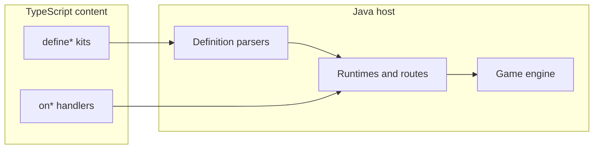

# TypeScript Bridge Improvements Roadmap

**Last reviewed:** 2026-08-07 (against codebase + [TYPESCRIPT_BRIDGE_REVIEW.md](../../TYPESCRIPT_BRIDGE_REVIEW.md))

## Goal

Make `content/` the place you author OSRS-style content (skills, combat, items behavior, UI hooks, social) without writing Java. Java stays the engine/host; every gameplay system you port should have a TS registration or handler surface.

This roadmap is the **Phase 6+ extension** of the completed [typescript-content-platform](../typescript-content-platform/plan.md) plan. It does not replace that platform work — it adds kits, overlays, and host capabilities needed for full OSRS ports.

Scripts are bound to **loaded cache IDs**. ID ceilings are now raised to 65535 (`ScriptEntityLimits`, `content/src/core/limits.ts`, `ItemConstants.ITEM_LIMIT = 65536`). Porting “as much OSRS as possible” still requires growing the bridge **and** shipping an OSRS cache pack for visuals.

Existing pattern to copy everywhere: schema-v1 `defineX` → Java parser → Java-owned runtime → host routes (see [ScriptResourceRuntime.java](engine/server/src/main/java/com/rs2/script/resource/ScriptResourceRuntime.java) + [gathering.ts](content/src/sdk/gathering.ts)). Prefer that over one-off `onObject` spaghetti for repeated OSRS loops.

---

## Current status

| Phase | Status | Notes |
| --- | --- | --- |
| **0** — Entity capacity and author truth | **Done** | 65535 ceilings, `player.ts` / `bot.ts` quarantined, docs exist |
| **0.5** — Bridge hardening | **Done** | `BridgeValidation`, null-safe strings, `PolyglotException` logging, `beginEncounter` coordinate validation via `BridgeValidation`, `ScriptedPosition` cache; `ReadWriteLock` deferred |
| **1** — Player capability parity | **~90%** | equip/unequip, openBank, prayer, magic routes done; attack styles / venom TBD |
| **2** — Skilling kits | **In progress** | gathering packs + cooking via `defineProcessingSkill`; thieving/FM/agility kits pending |
| **3–8** | Phase 3–4 done; 5–8 pending | See phases below |

---

## Gap reference

Phases reference these gaps. Keep this table in sync when adding new phases.

| Gap | Description |
| --- | --- |
| **1** | Custom item/NPC/object definitions beyond raw cache (overlays + pack) |
| **2** | Client UI authoring and interface lifecycle |
| **3** | Skilling kit coverage (gathering, processing, thieving, FM, agility) |
| **4** | World NPC combat AI (non-boss mobs) |
| **5** | Player write APIs and economy/social (bank, trade, GE) |
| **6** | Author API confusion (dual `Player` / `ScriptedPlayer` contracts) |
| **7** | Minigame instance lifecycle |
| **8** | Content iteration workflow (watch, reload diagnostics) |

---

## Route precedence

Incremental OSRS porting depends on a single, documented rule. Implementation lives in [ScriptInteractionGate.java](engine/server/src/main/java/com/rs2/net/packets/impl/ScriptInteractionGate.java) and the route registries.

1. **Exact scripted route match** (object/NPC/item id + action + route kind) → script handler runs; legacy Java for that route is suppressed.
2. **No scripted registration** for that route → legacy Java behavior runs unchanged.
3. **Same cache id, different tile** → only the globally registered route fires; unregistered tiles keep legacy behavior (see [woodcutting.ts](content/src/resources/woodcutting.ts) comment on Dragon Island).

Kits must register host routes for every id they own so scripted content wins on port. Partial overlap during incremental porting is intentional: register only what you have ported; everything else falls through to legacy.

---

## Kit boundaries

| Kit | Use when | Do not use when |
| --- | --- | --- |
| **`defineBoss`** | Instanced/arena encounters, multi-phase, arena reservation, `ScriptEncounterService` ownership | World-spawned NPCs that share the open world |
| **`defineMob`** | World-spawned NPCs replacing `NpcCombat` switch cases; stat-driven AI with optional tick hooks | Multi-phase bosses, arena encounters, roster-wide rewards |
| **`defineGatheringResource`** | Tool + deplete/respawn + XP loops (woodcutting, mining, fishing) | Item-on-item processing (cooking, smithing) |
| **`defineProcessingSkill`** | Item-on-object cook/smith-style loops with tick delay, level, burn-style success, product | Gathering deplete/respawn loops (use `defineGatheringResource`); speculative shapes before a real port |
| **`defineRaid`** | Multi-room PvM with lobby, muster, roster-wide reward barrier | Single-room wave minigames (use `defineMinigame`) |
| **`defineMinigame`** | Wave/lobby minigames; compose `defineArea` + optional `defineRaid` primitives | Full multi-room raids with roster barriers (use `defineRaid`) |

### `defineMob` vs `defineBoss`

| Concern | `defineBoss` | `defineMob` |
| --- | --- | --- |
| Ownership | `ScriptEncounterService`, arena reservation | World spawn; no instance lock |
| Phases | Multi-phase lifecycle, spawn waves | Single stat block + optional hooks |
| AI | Encounter scripts drive behavior | **Java-owned** aggression radius, walk-to-target, and basic combat ticks from declarative stats; `onTick` / `onDeath` for custom logic only |
| Suppression | Encounter-scoped NPC handles | Registered `npcId` suppresses `NpcCombat` switch for that id globally |

`defineMob` does **not** require authors to implement pathing or aggression in callbacks — those come from the runtime when `aggression`, `attackSpeed`, `maxHit`, etc. are set. Callbacks are for ports that need custom behavior beyond stat-driven AI.

---

## Testing strategy (all new kits)

Every new `define*` kit or facade added in Phases 2+ should ship with:

1. **Parser validation tests** — malformed definitions fail content load with a clear error (id out of range, missing required field, duplicate key).
2. **Route authority tests** — scripted route consumes the packet; unregistered id falls through to legacy Java unchanged.
3. **Reload tests** — definitions survive `::scripts` reload without duplicate-route errors or stale callbacks.
4. **One representative content module** — at least one real OSRS-style port exercising the kit end-to-end.

---

## Phase 0 — Entity capacity and author truth ✅ Done

Unblocks real OSRS IDs and stops dual-API confusion.

1. ✅ **Raise ID ceilings** to 65535 — `ScriptEntityLimits`, bridge validators, `ItemConstants.ITEM_LIMIT`.
2. ✅ **Single player API for handlers** — `ScriptedPlayer` in [runtime.ts](content/src/core/runtime.ts) is canonical; [player.ts](content/src/core/player.ts) / [bot.ts](content/src/core/bot.ts) marked design-only.
3. ✅ **Contract docs** — [docs/SCRIPT_BRIDGE.md](../../docs/SCRIPT_BRIDGE.md) and auto-synced [docs/API_INVENTORY.md](../../docs/API_INVENTORY.md) exist; keep them updated per phase.

**Acceptance (regression checklist):**
- [x] TS builders and Java parsers reject ids > 65535.
- [x] `pnpm --filter @singlescape/content test` passes (API inventory in sync).
- [x] No handler examples import `Player` from `player.ts`.

---

## Phase 0.5 — Bridge hardening (prerequisite for new write APIs)

Address all **Priority 1** findings in [TYPESCRIPT_BRIDGE_REVIEW.md](../../TYPESCRIPT_BRIDGE_REVIEW.md) before adding more mutation surface (mob AI, overlays, trade hooks). New Java exports in Phases 1+ **must** use the shared validation utility.

| Review item | Deliverable |
| --- | --- |
| 1.4 Null/undefined coercion in string methods | ✅ Null-safe string handling in `ScriptedPlayer.message()`, `ScriptedNpc.forceChat()` |
| 1.5 `getRuntimeStatus()` race | ✅ Single synchronized snapshot returns generation + registry together |
| 1.7 `forceChat()` null validation | ✅ Same null-safe pattern as player message APIs |
| — `grantReward()` mutation guard | ✅ `canMutate()` check before reward application |
| — Guest exception logging | ✅ `ScriptExecutor` catches `PolyglotException` and logs guest source location |
| 1.1 ProxyExecutable lacks input validation | ✅ Shared `BridgeValidation` for integral coercion; facades delegate to it |
| 1.2 `SkillView.setLevel()` arbitrary modification | Route mutations through game logic; strengthen `canMutate()` guards |
| 1.3 / 1.9 `ScriptHost` synchronized bottleneck | `ReadWriteLock` for registry reads vs writes (deferred — larger refactor) |
| 1.6 `beginEncounter()` coordinate coercion | ✅ Integral coordinate validation with range checks via `BridgeValidation` in `ScriptEncounterService` |
| 1.8 Hot-path allocations | ✅ Cache `ScriptedPosition` in `ScriptedPlayer.getPosition()` |

**Acceptance:**
- [x] `BridgeValidation` utility with unit tests; facades delegate integral coercion to it.
- [x] `ScriptExecutor` logs `PolyglotException` guest source location.
- [x] Null message/chat inputs are ignored without throwing.
- [x] `getRuntimeStatus()` returns generation + registry from one synchronized snapshot.
- [x] `grantReward()` checks `canMutate()` before applying rewards.
- [ ] `ReadWriteLock` on `ScriptHost` dispatch paths (deferred — larger refactor).
- [x] `beginEncounter()` integral coordinate validation.
- [x] `ScriptedPosition` cached in `ScriptedPlayer.getPosition()`.
- [ ] Per-phase gate: no new write API merges without passing the validation checklist above.

---

## Phase 1 — Player capability parity (~90% done)

Make a script able to do what Java content already does to a player.

| API | Status | Where |
| --- | --- | --- |
| `equip` / `unequip` / slot bonuses | ✅ Done | [ScriptedEquipment.java](engine/server/src/main/java/com/rs2/script/capability/ScriptedEquipment.java), [equipment.ts](content/src/sdk/equipment.ts) |
| `openBank()` | ✅ Done | [ScriptedPlayer.java](engine/server/src/main/java/com/rs2/script/ScriptedPlayer.java) |
| Prayer view | ✅ Done | [ScriptedPrayer.java](engine/server/src/main/java/com/rs2/script/capability/ScriptedPrayer.java), [prayer.ts](content/src/sdk/prayer.ts) |
| Magic on NPC/player + rune helpers | ✅ Done | [ScriptBindings.java](engine/server/src/main/java/com/rs2/script/ScriptBindings.java), [magic.ts](content/src/sdk/magic.ts) |
| Combat facade expansion | Partial | `underAttack()`, `poisoned()` done; attack styles, venom TBD |

**Remaining:**
- Attack style read/set if OSRS combat ports need it.
- Venom support on `ScriptedCombat` if ports require it.
- Sync [SCRIPT_BRIDGE.md](../../docs/SCRIPT_BRIDGE.md) inline types for new facades.

**Acceptance:**
- [x] Equipment write round-trips through `ItemAssistant` with facade guards.
- [x] `onMagicOnNpc` / `onMagicOnPlayer` register and dispatch.
- [ ] Combat style / venom APIs documented and tested if added.

---

## Phase 2 — Skilling kits (close gap 3) — **next feature work**

Extend the gathering runtime pattern instead of hand-rolling every skill.

**Build order within this phase (do not skip):**

1. ✅ **Mining + fishing gathering packs** — reuse [ScriptResourceRuntime.java](engine/server/src/main/java/com/rs2/script/resource/ScriptResourceRuntime.java). Add TS modules under `content/src/resources/` mirroring [woodcutting.ts](content/src/resources/woodcutting.ts).
2. ✅ **One processing port via raw handlers** — cooking shrimp on cooking range 114 via `onItemOnObject` (proved the loop).
3. ✅ **Extract `defineProcessingSkill`** — item-on-object + tick delay + level + burn-style success + product, from the cooking port ([processing.ts](content/src/sdk/processing.ts), [ScriptProcessingRuntime.java](engine/server/src/main/java/com/rs2/script/processing/ScriptProcessingRuntime.java)).
4. **`defineThievingTarget`**, **`defineFiremakingSpot`**, **`defineAgilityCourse`** — thin declarative kits once 2–3 real OSRS ports prove each shape.
5. Kits register host routes per [route precedence](#route-precedence) so they win over legacy Java for ported ids.

**Acceptance:**
- [x] Mining and fishing resource modules with at least one resource each.
- [x] Parser validation test: malformed gathering def fails load with clear error.
- [x] Route authority test: scripted gathering route consumes packet; unregistered object id keeps legacy.
- [x] One cooking loop works via raw handlers before `defineProcessingSkill` lands.
- [x] Reload test: resources survive `::scripts` without duplicate-route errors (`ScriptGatheringResourceE2ETest.reloadClosesGenerationSessionsAndKeepsRejectedReloadIntact`).

---

## Phase 3 — World mob AI (close gap 4) ✅ Done

Bosses work via `defineBoss`. Add the missing world-NPC authoring path:

- **`defineMob({ npcId, aggression, combatStyle, attackSpeed, maxHit, onSpawn, onTick, onDeath, ... })`**
- Java `ScriptMobRuntime` installs behavior for that cache NPC id.
- **NpcCombat suppression:** registered `npcId` skips the legacy `NpcCombat` switch; unregistered ids unchanged.
- **AI split:** runtime handles aggression radius, pathing to target, and basic attack ticks from declarative stats; callbacks are optional overrides, not required for a functioning mob.
- Reuse encounter NPC handle primitives (walk/face/damage/animate) already on the bridge.
- **Not** a full custom NPC graphic API — still cache-bound `npcId` until Phase 4 pack ships.
- **Not** for arena bosses — use `defineBoss` (see [kit boundaries](#kit-boundaries)).

**Acceptance:**
- [x] Registered mob id suppresses `NpcCombat` switch; unregistered ids unchanged.
- [x] Parser validation test: invalid mob def rejected at load.
- [x] `onTick` / `onDeath` callbacks invalidated on reload and NPC despawn.
- [x] At least one world mob ported entirely in TS (e.g. a low-tier guard or goblin).

---

## Phase 4 — Definition overlays (close gap 1, OSRS port critical) ✅ Done

You cannot invent new client graphics without cache work, but you **can** author server behavior and light metadata from TS:

1. **`defineItemOverlay` / `defineNpcOverlay` / `defineObjectOverlay`**: name, examine, stackability, equip slot/reqs/bonuses, NPC combat stats, object actions — merged at load over cache defs when present; reject unknown ids until cache pack includes them.
2. **Cache pack pipeline — use existing [asset-pipeline](../asset-pipeline/plan.md), not greenfield tooling:**
   - Phases 1–6 (completed): decoders, OSRS region import, terrain/landscape export, model backport.
   - **[Phase 7](../asset-pipeline/phases/phase-7.md) (completed):** custom asset namespace — ID allocation registry, object definition encoder, safe custom-range constants.
   - **[Phase 8](../asset-pipeline/phases/phase-8.md) (completed):** dual model decoder — SMF format for custom models (ID 50000+).
   - **Handoff:** asset-pipeline produces IDs and cache entries; bridge overlays attach server behavior to those IDs. Without this pipeline, OSRS ports stay remapped onto 2006 ids.
3. **Load order:** cache definition → overlay merge → reject if id missing from cache.
4. Keep `onItem` / `onNpc` / `onObject` for one-off interactions; overlays + kits for data-heavy OSRS tables.

**Acceptance:**
- [x] Overlay merge is deterministic and logged at `::scripts` load.
- [x] Unknown id in overlay fails content load with a clear error.
- [x] One OSRS item/NPC/object ported with overlay + asset-pipeline custom-namespace id (not remapped to 2006 id).

---

## Phase 5 — Client UI realism (close gap 2)

Full “design new interfaces in TS” needs client changes. Practical bridge path:

1. Richer helpers on presentation: open interface by id, `setText` / `setItemModel` (exists), hide/show children, set scrollbar, send config/varp-like state if the protocol supports it.
2. **`defineInterfaceHook` pack**: group `onButton` handlers + open/close lifecycle for one interface id (quest journals, skill guides, custom shops).
3. **Later client track:** custom interface definitions compiled into cache — only after Phase 4 pack pipeline exists. Do not block content ports on this; reuse OSRS interface ids from the cache you ship.

**Acceptance:**
- [ ] `defineInterfaceHook` registers all button routes for one interface id atomically.
- [ ] One quest journal or skill guide ported using OSRS interface id from shipped cache.

---

## Phase 6 — Economy and social (close gap 5 remainder)

Needed for authentic OSRS ports, not for early skilling/PvM. Tighten scope to avoid ballooning.

**MVP scope (ship this first):**

| Capability | MVP behavior |
| --- | --- |
| Trade | `onTradeRequest` with allow/deny only; **Java trade UI stays host-owned**; scripts cannot mutate offers in MVP |
| PvP / wilderness | Skull state, safe-area check via `getCombat()`; `onPlayerDeath` already exists |
| PM | `onPrivateMessage` observe-only; no send API in MVP |

**Later (explicitly out of MVP):**
- Trade offer mutate / accept hooks if Java trade cannot express a port.
- Friends / ignore lists.
- Grand Exchange (`defineGeOffer` / open GE) — after shop/bank parity; requires Java protocol matching.

**Acceptance:**
- [ ] Script can block trade initiation with a user-facing message.
- [ ] Scripts cannot mutate trade offers in MVP (gate-only).
- [ ] Wilderness skull / safe-area query available on combat facade.
- [ ] GE explicitly out of MVP; tracked as separate work item.

---

## Phase 7 — Minigames, randoms, bots (close gaps 7+)

1. **`defineMinigame`**: instance lifecycle, join/leave, score, NPC waves. **Compose existing kits** where possible:
   - `defineArea` for lobby/arena bounds and entry gates.
   - `defineRaid` when the minigame needs multi-room PvM with roster-wide reward barriers.
   - `defineMob` / `defineBoss` for wave NPCs inside the instance.
2. Random event / login interruption hooks if OSRS parity is required.
3. **Bots:** wire [bot.ts](content/src/core/bot.ts) to a simulated-player host **or** keep quarantined (already marked design-only). Treat as parallel product, not content-authoring.

**Acceptance:**
- [ ] One wave-based minigame (e.g. Pest Control lobby + waves) ported with `defineMinigame` composing `defineArea`.
- [ ] Bot module status documented: wired or explicitly deferred.

---

## Phase 8 — Workflow polish (close gap 8)

Keep iteration cheap while porting:

- Documented one-command loop: `pnpm build:content` → `::scripts` (see [SCRIPTING.md](engine/server/SCRIPTING.md)).
- ✅ Watch mode in root [package.json](../../package.json) (`pnpm watch`).
- Fail-fast reload diagnostics for duplicate routes (extend route registry reporting).
- `::scripts status` shows quarantine warnings from reload (see review item 2.3.3).

**Acceptance:**
- [ ] CONTRIBUTING or SCRIPTING.md documents the full edit-reload loop.
- [ ] Duplicate route registration fails load with route key in error message.
- [ ] Quarantine state visible in `::scripts status` output.

---

## Suggested build order (next PRs)

### Foundation (done)

| Deliverable | Closes |
| --- | --- |
| ID ceiling + ScriptedPlayer-only contract | Gap 6 |
| Equipment + openBank + prayer + magic | Gap 5 (player) |
| Docs (`SCRIPT_BRIDGE.md`, `API_INVENTORY.md`) + watch workflow | Gap 8 (partial) |

### Next PRs

| Order | Deliverable | Closes | Status |
| --- | --- | --- | --- |
| **1** | Bridge hardening (Phase 0.5) | Stability | **Done** (ReadWriteLock deferred) |
| **2** | Mining/fishing gathering packs | Gap 3 | **Done** |
| **3** | One cooking port (raw handlers) → `defineProcessingSkill` | Gap 3 | **Done** |
| **4** | `defineMob` world AI | Gap 4 | **Done** |
| **5** | Overlays + asset-pipeline handoff (phases 7–8 ids) | Gap 1 | **Done** |
| **6** | Interface hook packs + presentation helpers | Gap 2 | Pending |
| **7** | Trade gate + PvP queries (MVP scope) | Gap 5 (social) | Pending |
| **8** | Minigame kit; bot wiring decision | Gap 7 | Pending |
| **9** | Reload diagnostics + duplicate-route errors | Gap 8 | Pending |

---

## Explicit non-goals for early phases

- Replacing the Java engine tick/combat math wholesale.
- Designing brand-new client UIs before a cache pack pipeline exists.
- Treating aspirational [player.ts](content/src/core/player.ts) / bot types as runnable.
- Full scripted trade / GE in pure TS without Java protocol support.
- Speculating additional processing shapes (item-on-item herblore, etc.) before a second real port extends `defineProcessingSkill`.

## What “done enough for OSRS ports” looks like

You can implement a new OSRS skill loop, NPC combat behavior, quest, shop, and equipment-gated content entirely under `content/src/**` against OSRS cache IDs, reload with `::scripts`, and only touch Java when adding a new *kit type* or host capability — not for each piece of content.
