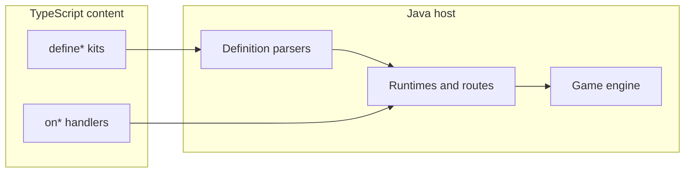

## Goal

Make `content/` the place you author OSRS-style content (skills, combat, items behavior, UI hooks, social) without writing Java. Java stays the engine/host; every gameplay system you port should have a TS registration or handler surface.

Hard constraint today: scripts are still bound to **loaded cache IDs** and low ceilings (`ITEM_LIMIT = 15000` in [ItemConstants.java](engine/server/src/main/java/com/rs2/game/items/ItemConstants.java); NPC/object checks often `0..14999`). Porting “as much OSRS as possible” requires raising capacity **and** growing the bridge.

Existing pattern to copy everywhere: schema-v1 `defineX` → Java parser → Java-owned runtime → host routes (see [ScriptResourceRuntime.java](engine/server/src/main/java/com/rs2/script/resource/ScriptResourceRuntime.java) + [gathering.ts](content/src/sdk/gathering.ts)). Prefer that over one-off `onObject` spaghetti for repeated OSRS loops.

---

## Phase 0 — Entity capacity and author truth

Unblocks real OSRS IDs and stops dual-API confusion.

1. **Raise ID ceilings** for items/NPCs/objects to match the cache you will actually ship (OSRS packs exceed 15k). Touch bridge validators in [ScriptFunctions.java](engine/server/src/main/java/com/rs2/script/ScriptFunctions.java), drop/shop/boss/area parsers, and engine `ITEM_LIMIT`.
2. **Single player API for handlers:** treat [runtime.ts](content/src/core/runtime.ts) `ScriptedPlayer` as canonical. Mark or quarantine [player.ts](content/src/core/player.ts) / [bot.ts](content/src/core/bot.ts) as non-runtime so ports do not call methods that do not exist on Graal wrappers.
3. **Ship missing contract docs as a side deliverable of each phase** (not a blocker): recreate `docs/SCRIPT_BRIDGE.md` + `docs/API_INVENTORY.md` as APIs land so `SCRIPTING.md` stops lying.

---

## Phase 1 — Player capability parity (highest leverage)

Make a script able to do what Java content already does to a player.

| API | Where | Behavior |
| --- | --- | --- |
| `equip` / `unequip` / slot bonuses | [ScriptedEquipment.java](engine/server/src/main/java/com/rs2/script/capability/ScriptedEquipment.java) | Delegate to `ItemAssistant.wearItem` / `removeItem`; keep generation/facade guards |
| `openBank()` / deposit helpers | [ScriptedPlayer.java](engine/server/src/main/java/com/rs2/script/ScriptedPlayer.java) + bank view | Open bank UI; keep existing mutate APIs |
| Prayer view | new `ScriptedPrayer` | activate/deactivate/isActive/drain; wrap Java prayer package |
| Magic completeness | [ScriptBindings.java](engine/server/src/main/java/com/rs2/script/ScriptBindings.java) | Add `onMagicOnNpc`, `onMagicOnPlayer`; expose rune check / consume helpers |
| Combat facade expansion | `ScriptedCombat` | attack styles, under-attack, poison/venom hooks as needed for ports |

SDK mirrors in [equipment.ts](content/src/sdk/equipment.ts) and new `sdk/prayer.ts` / `sdk/magic.ts`. Update [runtime.ts](content/src/core/runtime.ts) types in the same PR as Java.

---

## Phase 2 — Skilling kits (close gap 3)

Extend the gathering runtime pattern instead of hand-rolling every skill.

1. **Generalize gathering** so mining/fishing/power-chop variants reuse [ScriptResourceRuntime.java](engine/server/src/main/java/com/rs2/script/resource/ScriptResourceRuntime.java) (tools, deplete/respawn, XP, multi-reward). Add TS packs under `content/src/resources/` (mining, fishing) mirroring [woodcutting.ts](content/src/resources/woodcutting.ts).
2. **New `defineProcessingSkill`** (or similar) for cook/smith/fletch/herblore loops: item-on-object / item-on-item + tick delay + level + success chance + product.
3. **New `defineThievingTarget`**, **`defineFiremakingSpot`**, **`defineAgilityCourse`** as thin declarative kits once 2–3 real OSRS ports prove the shape.
4. Skill XP/level already exists via `getSkills()`; kits must register host routes so they win over legacy Java for the same object/NPC id when you port.

---

## Phase 3 — World mob AI (close gap 4)

Bosses already work via `defineBoss`. Add the missing world-NPC authoring path:

- **`defineMob({ npcId, aggression, combatStyle, attackSpeed, maxHit, onSpawn, onTick, onDeath, ... })`**
- Java `ScriptMobRuntime` installs behavior for that cache NPC id (replace or suppress legacy `NpcCombat` switch for registered ids).
- Reuse encounter NPC handle primitives (walk/face/damage/animate) already on the bridge.
- Not a full “custom NPC graphic” API — still cache-bound `npcId` until Phase 5.

---

## Phase 4 — Definition overlays (close gap 1, OSRS port critical)

You cannot invent new client graphics without cache work, but you **can** author server behavior and light metadata from TS:

1. **`defineItemOverlay` / `defineNpcOverlay` / `defineObjectOverlay`**: name, examine, stackability, equip slot/reqs/bonuses, NPC combat stats, object actions — applied at load over cache defs when present; reject unknown ids until cache pack includes them.
2. **Cache pack pipeline (separate track):** tooling to inject OSRS models/IDs into the client cache the server loads. Bridge overlays attach behavior; pack supplies visuals. Without this, ports stay remapped onto existing 2006 ids.
3. Keep `onItem` / `onNpc` / `onObject` for one-off interactions; overlays + kits for data-heavy OSRS tables.

---

## Phase 5 — Client UI realism (close gap 2)

Full “design new interfaces in TS” needs client changes. Practical bridge path:

1. Richer helpers on presentation: open interface by id, `setText` / `setItemModel` (exists), hide/show children, set scrollbar, send config/varp-like state if the protocol supports it.
2. **`defineInterfaceHook` pack**: group `onButton` handlers + open/close lifecycle for one interface id (quest journals, skill guides, custom shops).
3. **Later client track:** custom interface definitions compiled into cache — only after Phase 4 pack pipeline exists. Do not block content ports on this; reuse OSRS interface ids from the cache you ship.

---

## Phase 6 — Economy and social (close gap 5 remainder)

Needed for authentic OSRS ports, not for early skilling/PvM:

1. Trade: script hooks `onTradeRequest` / offer mutate / accept — or at least “block/allow” + listen; full scripted trade UI is optional if Java trade stays host-owned.
2. Friends / ignore / PM: thin events (`onPrivateMessage`) if bots or plugins need them.
3. PvP/wilderness rules: `getCombat()` + skull/safe-area queries; `onPlayerDeath` already exists.
4. Grand Exchange: large host runtime (`defineGeOffer` / open GE) — schedule after shop/bank parity; do not invent GE in pure TS without Java matching protocol.

---

## Phase 7 — Minigames, randoms, bots (close gaps 7+)

1. **`defineMinigame`**: instance lifecycle, join/leave, score, NPC waves — generalize Fight Caves / Pest Control style ports (raid kit already covers multi-room PvM).
2. Random event / login interruption hooks if you want OSRS parity.
3. **Bots:** either wire [bot.ts](content/src/core/bot.ts) profiles to a real simulated-player host, or delete/hide until then so they are not mistaken for live APIs. Treat as parallel product, not content-authoring.

---

## Phase 8 — Workflow polish (close gap 8)

Keep iteration cheap while porting:

- Documented one-command loop: `tsc` → `content/dist` → `::scripts` (already in [SCRIPTING.md](engine/server/SCRIPTING.md)).
- Optional watch mode + content package scripts in root [package.json](package.json).
- Fail-fast reload diagnostics for duplicate routes (already partially there via route registry).

---

## Suggested build order (first PRs)

| Order | Deliverable | Closes |
| --- | --- | --- |
| 1 | ID ceiling + ScriptedPlayer-only authoring contract | Foundation / gap 6 |
| 2 | Equipment write + `openBank` + prayer + magic-on-npc/player | Gaps 5, banking |
| 3 | Mining/fishing via gathering runtime + processing kit | Gap 3 |
| 4 | `defineMob` world AI | Gap 4 |
| 5 | Item/NPC/object overlays + cache pack track | Gap 1 |
| 6 | Interface hook packs + presentation helpers | Gap 2 |
| 7 | Trade/PvP queries; GE later | Gap 5 social |
| 8 | Minigame kit; bot wiring or quarantine | Gaps 7–8 |

---

## Explicit non-goals for early phases

- Replacing the Java engine tick/combat math wholesale.
- Designing brand-new client UIs before a cache pack pipeline exists.
- Treating aspirational [player.ts](content/src/core/player.ts) / bot types as runnable.

## What “done enough for OSRS ports” looks like

You can implement a new OSRS skill loop, NPC combat behavior, quest, shop, and equipment-gated content entirely under `content/src/**` against OSRS cache IDs, reload with `::scripts`, and only touch Java when adding a new *kit type* or host capability — not for each piece of content.